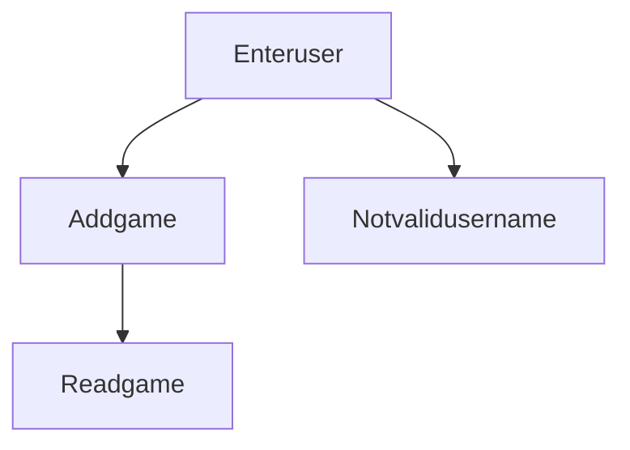

# dfe-project This project is set out to create a app that lets a user enter info called do I own it, where they will be able to enter information that can track if they own a certain game or not. 

The application will alow users to signin(with records being stored on a database to then be able to keep track by entering info that goes into another database that keep tracks of the games that they own.

Some potential risks the database being hacked into showing the users email accounts would use hash encrypting when storing the data.  

